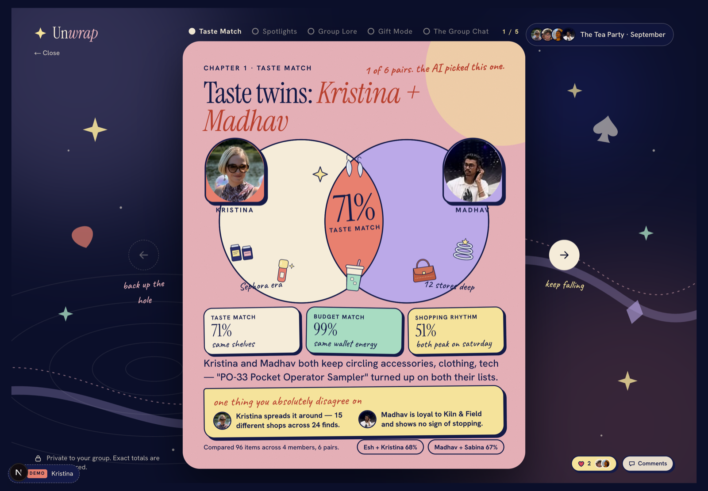
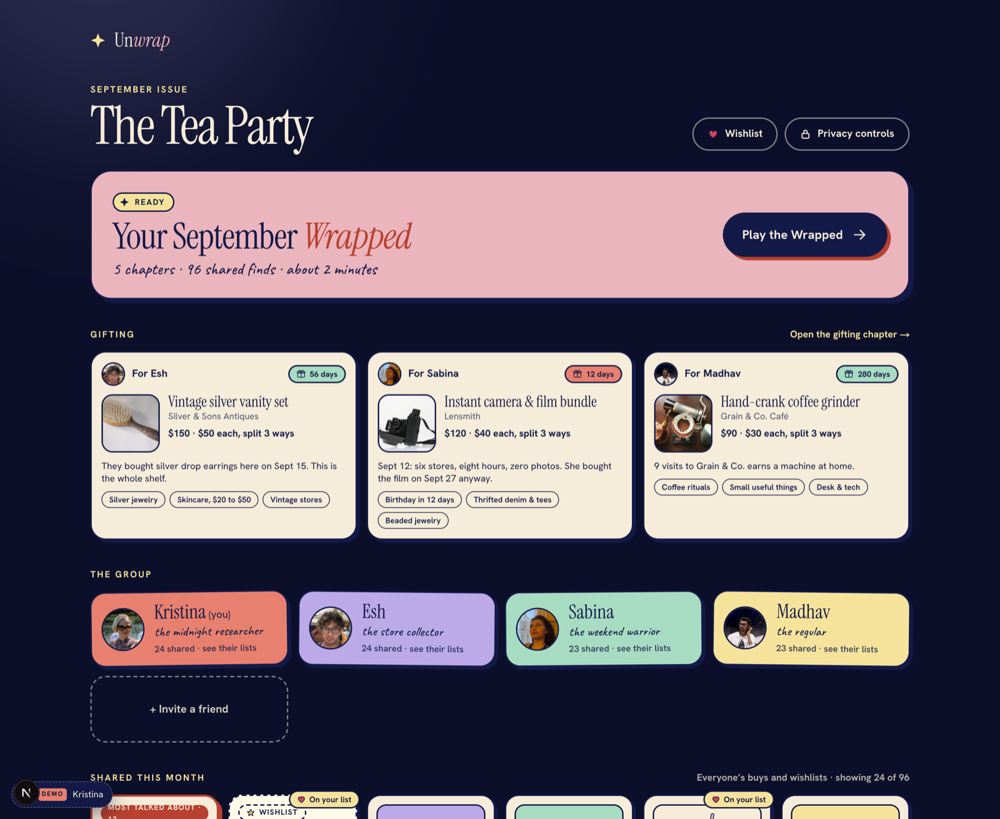
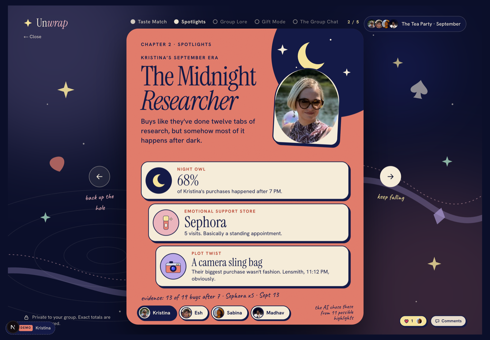
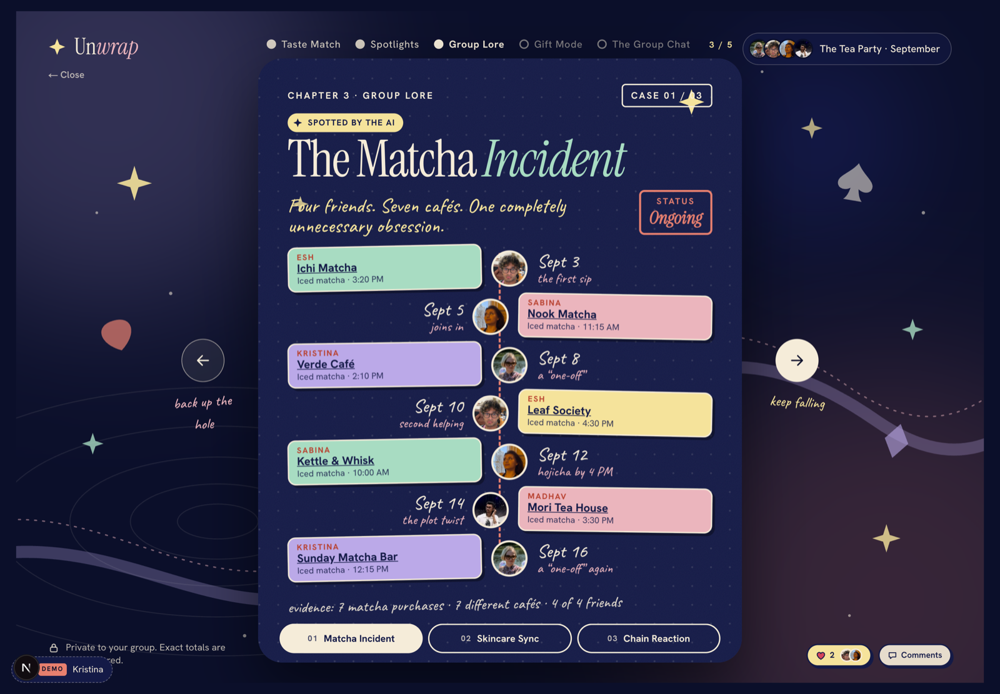
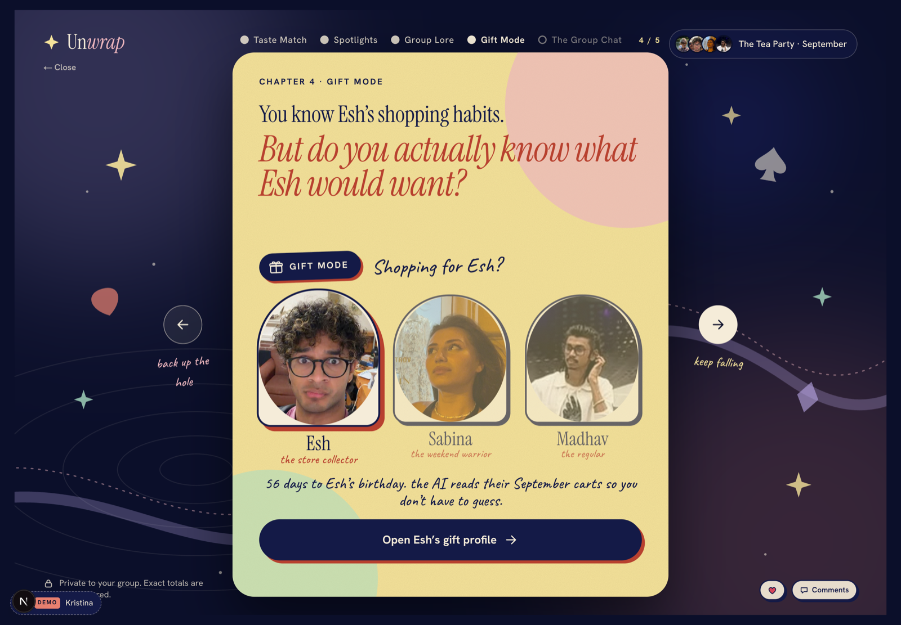
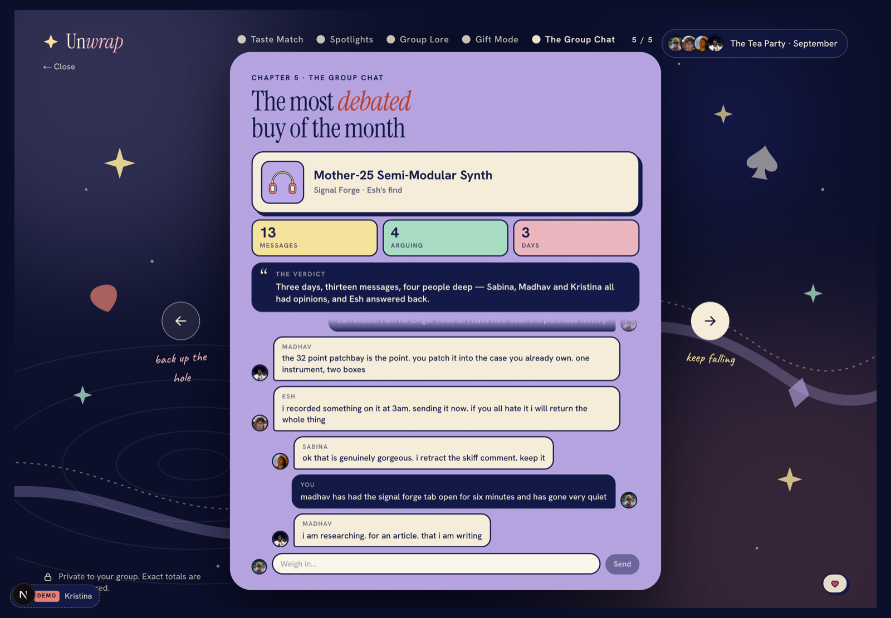
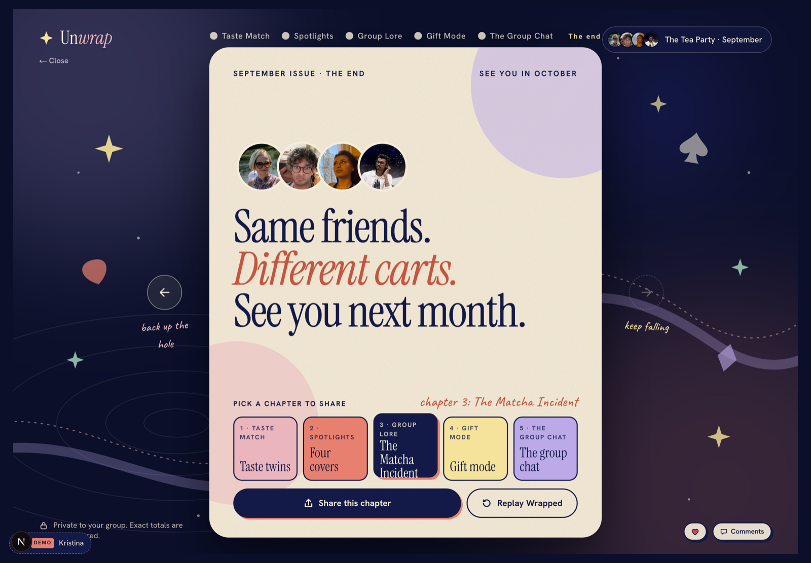

<h1 align="center">Un<em>wrap</em></h1>

<p align="center">
  A private monthly recap for a close friend group.<br />
  Social first, commerce second: every recommendation arrives as something a friend already found.
</p>

<p align="center">
  
  
  
  
  
  
</p>

<p align="center">
  
</p>

<p align="center"><em>Every number on that card was computed from the group's real items. Only the words around them were written by a model.</em></p>

Three pieces. A Next.js app, a Fastify API with Anthropic doing the reasoning and
Visa Direct moving the money, and a Chrome extension that saves a product from the
page you found it on.

```bash
# backend
cd backend && pnpm install
cp .env.example .env                 # runs offline as-is
pnpm dev                             # http://localhost:8080

# frontend, in a second terminal, from the repo root
npm install
cp .env.local.example .env.local     # API base URL + the viewer to sign in as
npm run dev                          # http://localhost:3000
```

Out of the box `.env.example` is fully offline: `DB_MODE=memory` seeds from
fixtures, `LLM_MOCK=true` resolves every model call to a registered fixture and
`VISA_MODE=mock` answers like the sandbox does. Fill in the credentials and the
same code paths go live — there is no separate "demo" implementation.

**Fast mode**, for iterating on the UI without Postgres, model latency or Visa:

```bash
cd backend && PORT=8081 DB_MODE=memory DEMO_MODE=true LLM_MOCK=true VISA_MODE=mock pnpm dev
NEXT_PUBLIC_API_BASE_URL=http://localhost:8081 npm run dev
curl -X POST localhost:8081/demo/reset          # 204 — back to the seeded month
```

## The demo path

`/` is the group: who is in it, everything shared this month, and the way into
`/wrapped`. A gift → buy sheet → passkey → confirmed → back to the story.
`/wishlist` is your own saves, `/settings` the privacy controls, `/join` the
invite flow.

<p align="center">
  
</p>

In the Wrapped: **← →** navigate, **space** advances, **R** replays. On a phone,
swipe or tap (right 60% forward, left 40% back).

## The six cards

<table>
  <tr>
    <td width="50%"></td>
    <td width="50%"></td>
  </tr>
  <tr>
    <td><b>1 · Taste match.</b> The closest pair in the group, and the three
    scores that say why. Computed from their rows, not written by the model.</td>
    <td><b>2 · Spotlights.</b> One cover per member — the same system, four
    different layouts, built from what each person actually bought.</td>
  </tr>
  <tr>
    <td></td>
    <td></td>
  </tr>
  <tr>
    <td><b>3 · Group lore.</b> Three case files. The Matcha Incident is seven
    cafés across four friends, evidenced purchase by purchase.</td>
    <td><b>4 · Gift mode.</b> The live group pool. Claude reads the recipient's
    September and must cite their real items to justify a pick.</td>
  </tr>
  <tr>
    <td></td>
    <td></td>
  </tr>
  <tr>
    <td><b>5 · The group chat.</b> The month's most argued-about buy, with the
    real thread under it — and you can still reply from the card.</td>
    <td><b>6 · Closing.</b> The month in one frame, and the way back in.</td>
  </tr>
</table>

## Layout model

Cards are drawn at the design's exact pixel sizes — 1440 × 1000 for the desktop
shell with a 720 × 900 card inside it, 390 × 844 full-bleed on mobile — and
`components/primitives/Stage.tsx` scales the whole stage to fit the viewport.
Nothing reflows between cards, so there are no layout jumps and the proportions
stay identical to the design at any window size.

## Where things live

```
src/
  app/            routes: / (group), wrapped, wishlist, join, settings
  components/
    primitives/   Avatar, ProductArt (66 illustrations), Stage, Glyphs
    shell/        the 1440×1000 desktop page shell
    chapters/     the six desktop story cards
    spotlights/   four spotlight covers — one system, varied layouts
    lore/         three lore case files
    mobile/       the 390×844 adaptations
    commerce/     BuySheet: options → spend limit → passkey → confirmation
    wrapped/      ReactionBar
  data/           seeded users, purchases, products, recommendations, reactions
  lib/            api client + the response types the backend actually returns
  services/       checkout.ts (Visa-shaped), commerce.ts (sourcing + matching)
  state/          one reducer for reactions, privacy, saved items, orders
```

Cards that read from the backend keep their seeded fixture as a fallback, so a
cold API or a group with too little signal renders the static version of the
chapter rather than an empty one.

## The backend

`backend/` is a Fastify + TypeScript API over Supabase, with the AI and the
payments both real.

```
backend/src/
  routes/         me, groups, items, finds, wishlist, reactions, comments,
                  wrapped, tasteMatch, debate, threads, contributions,
                  reveals, birthdays, passkeys, ingest
  ai/             giftPicker, wrappedGenerator, tasteMatch, debateCopy,
                  ingest (receipt vision), taste, embed, llm — prompts under
                  ai/prompts/
  domain/         threadStateMachine, splits, permissions, productLinks
  visa/           visaDirect (pull/push/reverse), mle, client, cards
  db/             store (authoritative), postgres (hydrate), mirror (write-through)
```

**Persistence.** The in-memory store is authoritative for the duration of a
request; Postgres is a projection. The API hydrates its working set from
Supabase at boot and mirrors writes back through `db/mirror.ts`, so the demo
never blocks on a round trip but nothing is lost across a restart.

**Gift picking is genuinely AI.** `ai/giftPicker.ts` builds a taste profile from
what the recipient actually saved, searches the catalogue over embeddings, and
asks Claude for a shortlist. Every pick must cite real items the recipient
hearted or wishlisted — a pick that cites nothing is rejected and retried, so
the reasoning you read on a card is grounded in that person's own history.

**The Wrapped's numbers are computed, not written.** `ai/tasteMatch.ts` scores
every pair in the group off their real rows — a cosine over their weighted taste
vectors, another over their price-band histograms, another over their weekday
histograms — and hands the winning pair's three scores to the model, which writes
only the words around them. A number a model invents cannot answer "why 71?"; a
cosine over someone's actual items can. The copy is then checked for price
language and for ids it was not given, and falls back to a grounded template on
a bad round.

**Prices never reach a card.** Finds carry no prices, and the Wrapped compares
spending as a *shape* — which bands someone buys in — so the budget score can say
two people shop alike without either of them learning what the other spends.

**Visa Direct.** `visa/visaDirect.ts` speaks the Funds Transfer API directly
over two-way SSL: `pullfundstransactions` to collect each contributor's share,
`pushfundstransactions` to disburse, `reversefundstransactions` to unwind a
cancelled pool. All three are live against the Visa sandbox: `pnpm visa:smoke`
runs a pull, a push and a reversal and expects `actionCode: "00"` from each.

Our project has Message Level Encryption on, so plaintext bodies are rejected
outright; `visa/mle.ts` wraps every request as a compact JWE (`RSA-OAEP-256` +
`A128GCM`) under an `encData` key and decrypts the response, which Visa seals to
our own certificate. Transactions are written to an append-only audit trail.

Two diagnostics exist because both failures are miserable to re-derive from the
error text. `pnpm visa:probe` separates the three ways a call dies before it
reaches the funds-transfer logic — 9611 not entitled, 9005 no such route, 9125
MLE expected — and checks the MLE certificate is Visa's rather than the
client certificate that sits next to it on the dashboard, since encrypting to
our own key reproduces 9125 exactly.

**A gift pool is a state machine.** `picking → voting → collecting → funded →
bought → revealed`, with `refunding → refunded` for a cancellation. Every
transition is guarded in `domain/threadStateMachine.ts`, so a late vote or a
double approval is a 409 rather than a double charge.

**Privacy is enforced server-side, not hidden in the UI.** The recipient of a
gift gets a 404 — never a 403 — on the thread, the reveal and its comments,
because *whether a gift exists* is itself the secret. Hearts are returned as an
anonymous count and never name who reacted.

## The Chrome extension

`extension/` saves any product page to your wishlist, or shares it with the
group as a find. Manifest V3, no build step — `chrome://extensions` →
**Developer mode** → **Load unpacked** → pick `extension/`, then set the API
base URL (`8081` in fast mode, `8080` otherwise) in its options page and click a
viewer chip.

It scrapes in the page rather than server-side, because the retailers worth
saving from answer a bot user-agent with a 503 or a consent wall, and every
request goes through the service worker, because an MV3 worker fetching a host
in `host_permissions` is exempt from the backend's CORS policy. It adds no new
backend surface. See `extension/README.md`.

## Swapping in the rest

- **Product sourcing** — `services/commerce.ts`. `findOptions()` returns the same
  item, a close match and a budget option. Point it at a shopping-results API;
  callers don't change.
- **Payments UI** — `services/checkout.ts`, shaped after Visa Intelligent
  Commerce: `buildPaymentInstruction` → `requestPasskeyApproval` →
  `requestCredentials` → `completePurchase` → `sendOutcomeSignal`.
  `runCheckout()` drives the sheet's stages; the money itself moves through
  Visa Direct on the backend.

## Tests

```bash
npm test && npm run typecheck             # frontend + the extension's extractor
cd backend && pnpm test && pnpm typecheck
```

Both suites are offline and deterministic: the backend's `vitest.config.ts`
pins `DB_MODE=memory` and `LLM_MOCK=true` so a populated `.env` can never point
the suite at live Supabase or a real model.

Heavier checks that need things running live under `extension/test/`:
`live-api.mjs` drives the shipped save path against a real backend, and
`integration.mjs` goes out the other side — saving through the extension, then
driving a browser to `/wishlist` and `/wrapped` to confirm the item arrived with
its scraped image and price, and that a `private` save never reached the group.

## Design source

Ported from the Unwrap design canvas: colours, type scale, card grounds,
copy and animations come from those artboards. The landing, group, join and
settings screens are not in the canvas — they are built from the same system
(midnight ground, cream paper, ink outlines, hard offset shadows, Instrument
Serif over Hanken Grotesk with Caveat annotations).
